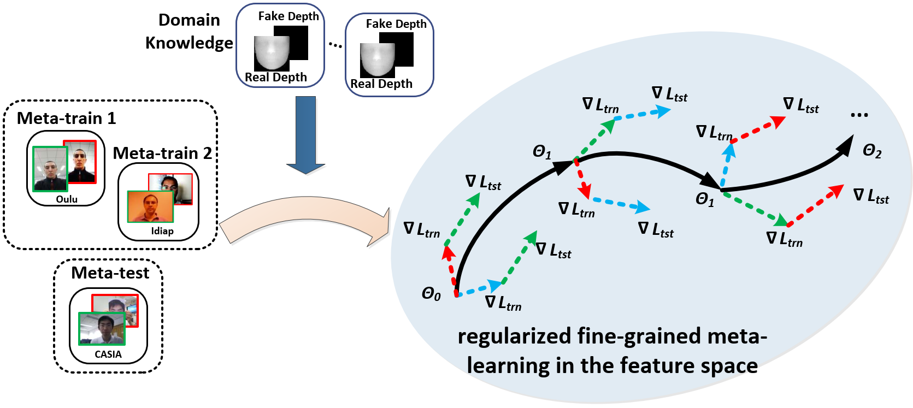
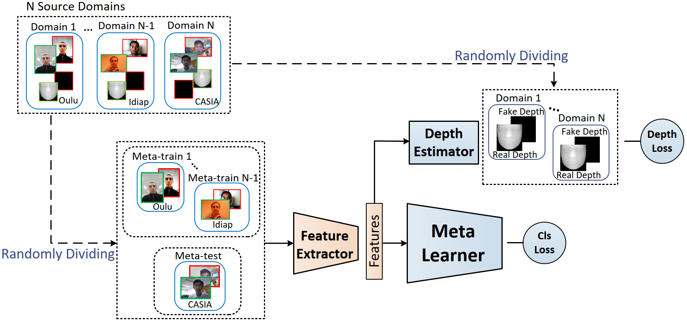

# AAAI2020-RFMetaFAS

Pytorch codes for Regularized Fine-grained Meta Face Anti-spoofing <a href=http://arxiv.org/pdf/1911.10771.pdf> (arxiv) </a> in AAAI 2020 

Idea of the proposed regularized fine-grained meta-learning framework. By incorporating domain knowledge as regularization, meta-learning is conducted in the feature space regularized by the domain knowledge supervision. Thus, generalized learning directions are more likely to be found for task of face anti-spoofing. Besides, the proposed framework adopts a fine-grained learning strategy that simultaneously conducts meta-learning in a variety of domain shift scenarios. Thus, more abundant domain shift information of face anti-spoofing task can be exploited.



Overview of proposed framework. We simulate domain shift by randomly dividing original N source domains in each iteration. Supervision of domain knowledge is incorporated via depth estimator to regularize the learning process of feature extractor. Thus, meta learner conducts the meta-learning in the feature space regularized by the auxiliary supervision of domain knowledge. 



# Setup

* Prerequisites: Python3.6, pytorch=0.4.0, Numpy, TensorboardX, Pillow, SciPy, h5py

* The source code folders:

  1. "models": Contains the network architectures suitable for high-order derivatives calculation of network parameters. Please note that FeatExtractor, DepthEstmator and FeatEmbedder in the code are feature extractor, depth estimator and meta learner in the paper, respectively. 
  2. "core": Contains the training and testing files. Note that we generate score for each frame during the testing.
  3. "datasets": Contains datasets loading
  4. "misc": Contains initialization and some preprocessing functions
  
# Training

To run the main file: python main.py --training_type Train

# Testing

To run the main file: python main.py --training_type Test

It will generate a .h5 file that contains the score for each frame. Then, we use these scores to calculate the AUC and HTER.

# Acknowledge
Please kindly cite this paper in your publications if it helps your research:
```
@InProceedings{Shao_2020_AAAI,
author = {Shao, Rui and Lan, Xiangyuan and Yuen, Pong C.},
title = {Regularized Fine-grained Meta Face Anti-spoofing},
booktitle = {Thirty-Fourth AAAI Conference on Artificial Intelligence (AAAI)},
year = {2020}
}
```

Contact: ruishao@comp.hkbu.edu.hk
